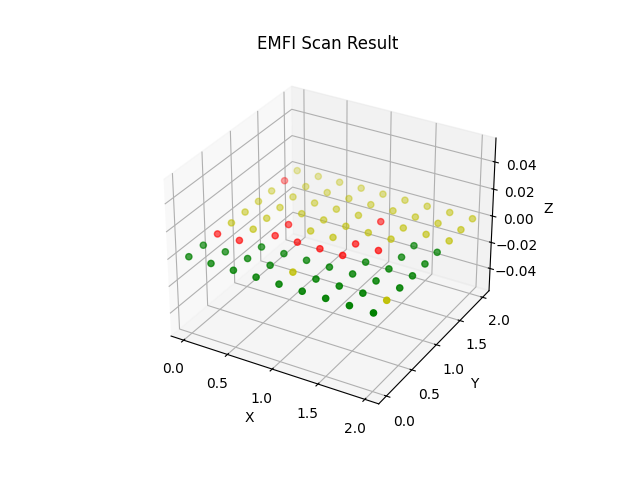

# EMFIScanner
Tool to operate a EMFI Probe with a 3D printer based positioning system and DUT evaluation


## Hardware setup

This considers a standard setup with a 3D printer accepting GCode over UART as positioning device, FaultyCat as EMFI probe, a Raspberry Pi Pico with firmware form the target folder, and a NewAE Technology PhyWhisperer for power reset of the Pico.


## Installation
```bash
git clone https://github.com/vector247/EMFIScanner
cd EMFIScanner
pip install -r requirements.txt
```

## Structure
The EMFI Scanner consists, in addition to the main file, of three main parts:
- Position Controller, handling the interface to a 3D printer or other GCode-controllable positioning device
- EMFI Controller, handling the EMFI probe
- Target Controller, handling the target 

## Configuration

### Main parameters

Main parameters can be found in main.py and usually require adjustment even when using the standard setup:
```python
# Configuration Parameter
POSITION_CONTROLLER_PORT = "COM25"  # Serial port connected to position controller
EMFI_PROBE_PORT = "COM23"           # Serial port connected to EMFI probe
EMFI_PROBE_BAUD = 115200            # Baudrate of EMFI probe
EMFI_PULSE_DURATION = 5             # EMFI probe pulse duration
EMFI_PULSE_POWER = 0.005            # EMFFI probe pulse power
TARGET_PROBE_PORT = "COM24"         # Serial port connected to target
TARGET_PROBE_BAUD = 115200          # Baudrate of target
TARGET_CHIP_WIDTH = 7               # Target chip width in mm               
TARGET_SCAN_HEIGHT = 0              # Height range in mm, if different distances between chip and probe shall be tested
```
These settings define the basic interfaces if the same setup is used as described above.

`handle_status` is a callback function that is called by the scanner function before each pulse set at a position and is used to update the progress in the status bar.
```python
def handle_status(current_task, total_tasks, last_result):
    user_interface.print_status(
        "Progress: "
        + str(round(current_task / total_tasks * 100, 2))
        + "% done | Last result: "
        + last_result
        + "              "
    )
```

`handle_pulse` is a callback function that is called by the scanner function to generate the pulse. In order to observe the target during the pulse, the read buffer reset just before the pulse.
```python
def handle_pulse():
    """
    Callback function handling the pulse generation
    """
    time.sleep(1)
    target_controller.reset_read_buffer()
    emfi_controller.pulse()
    # time.sleep(2)
```
`handle_target` is called by the scanner function right after each pulse, i.e. after each call of `handle_pulse`. It checks the status of the target and returns a single character which is used by plot function later to define the color of the dot at this position:
- 'y': in case of a target reset, detected by no data or low number of bytes read
- 'g': in case nothing happended, three consecutive numbers are received
- 'r': successful glitch, none of the above 
```python
def handle_target():
    data = target_controller.read(24).decode()
    if len(data) < 24:
        target_controller.reset_target()
        return "y"
    values = data.split("\r\n", 3)
    if (int(values[0]) + 1 == int(values[1])) and (
        int(values[1]) + 1 == int(values[2])
    ):
        return "g"
    return "r"
```

### Points to adjust in non default configuration
#### EMFI Probe
Adjust EMFIController.py and `handle_pulse` in main.py

#### 3D Printer
Ajust PositionController.py

#### Target 
Adjust TargetController.py and `handle_target` in main.py

## Usage

Configure as described above

```bash
python main.py
```

Move to lower left corner of target chip by using 'W', 'A', 'S', and 'D'. Use 'O' to move up (z-axis) and 'L' by 1mm and 'I' and 'K' to do fine adjustments.
Press 'R' to start the scan.

After finishing the scan a result plot is displayed:


Since no X, Y, and Z positions lower than 0 are allowed and the position at startup is considered origin (0, 0, 0), position the probe at lower X, Y, Z position before startup.
